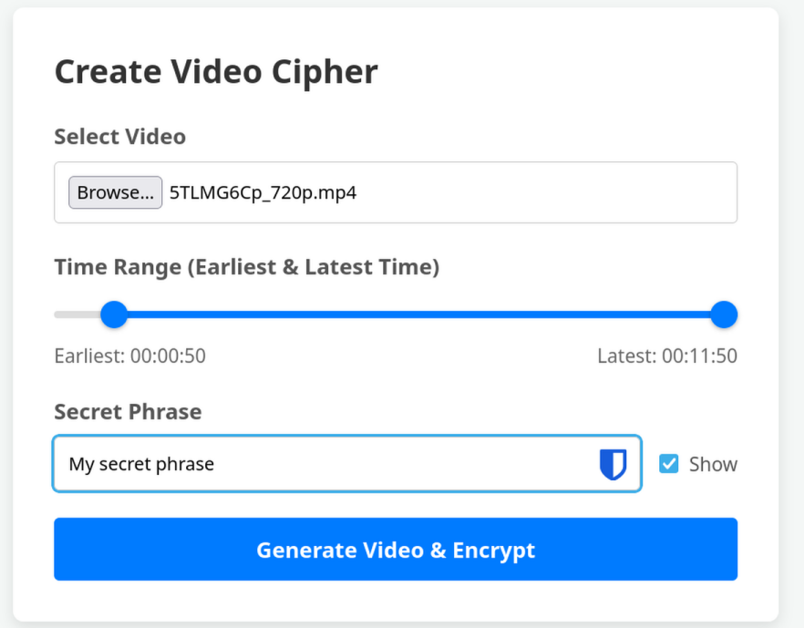
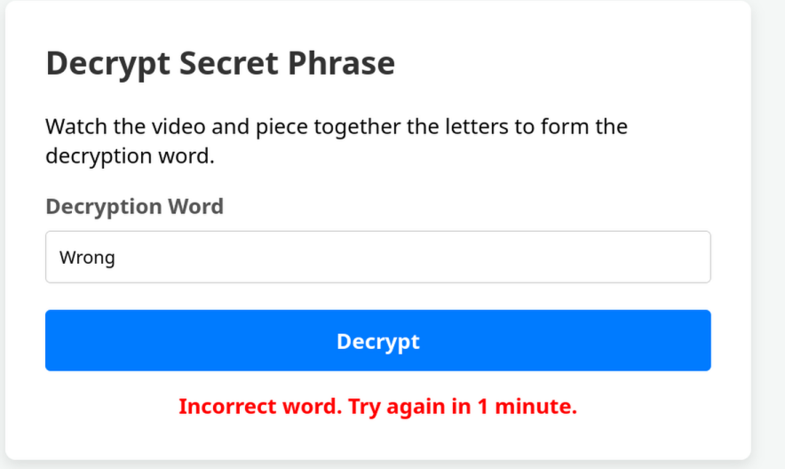

# Hidden In Plain Sight

- Vibecoded!

How to use:
- Choose a video
- Add your secret phrase
- Random word is added to video letter-by-letter, spread of over the entire video.
- Watch the entire video to learn the chosen random word
- Input the random word to retrieve your secret.

Better pay attention because each letter is only visible for 2 seconds and the order is scrambled.

## Features

- Limit time span when letter may be shown
- Remote input of random word: After encoding, you can choose to host a server with the same input box to retrieve your secret phrase.
  - Note: Browser apps on Android need the extra permission "Nearby devices" to access locally hosted web page.
- Online version (Slow!): Easier to use/run
  - Secret phrase is encrypted in the URL, so it can be accessed from anywhere at any time.

## Technical requirements for desktop app:

- Requires `ffmpeg` pre-installed
- Electron application. Start with `electron .`
- Only tested on Linux (NixOS, though any OS should work if you have the required components (ffmpeg, electron/node) installed).
